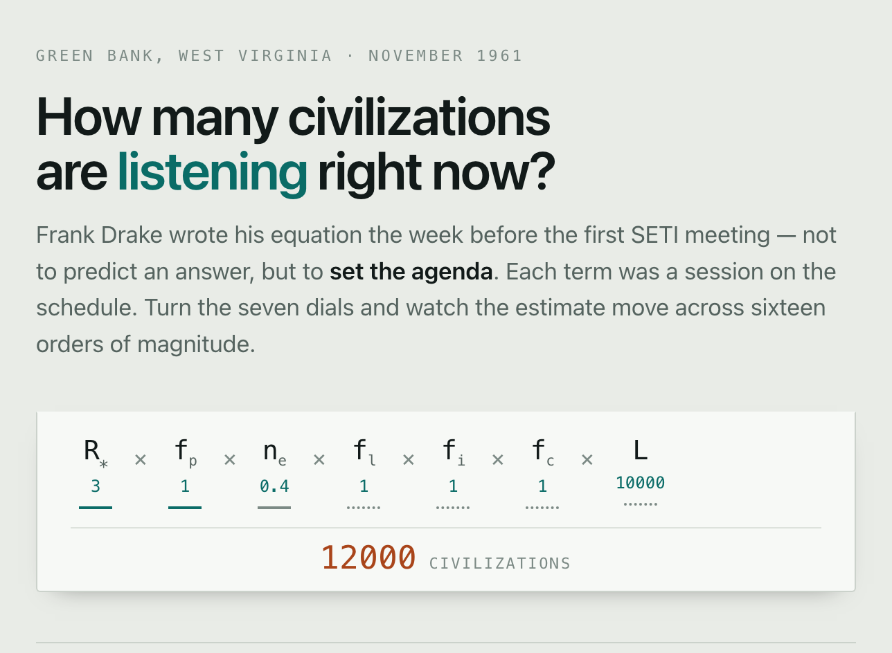
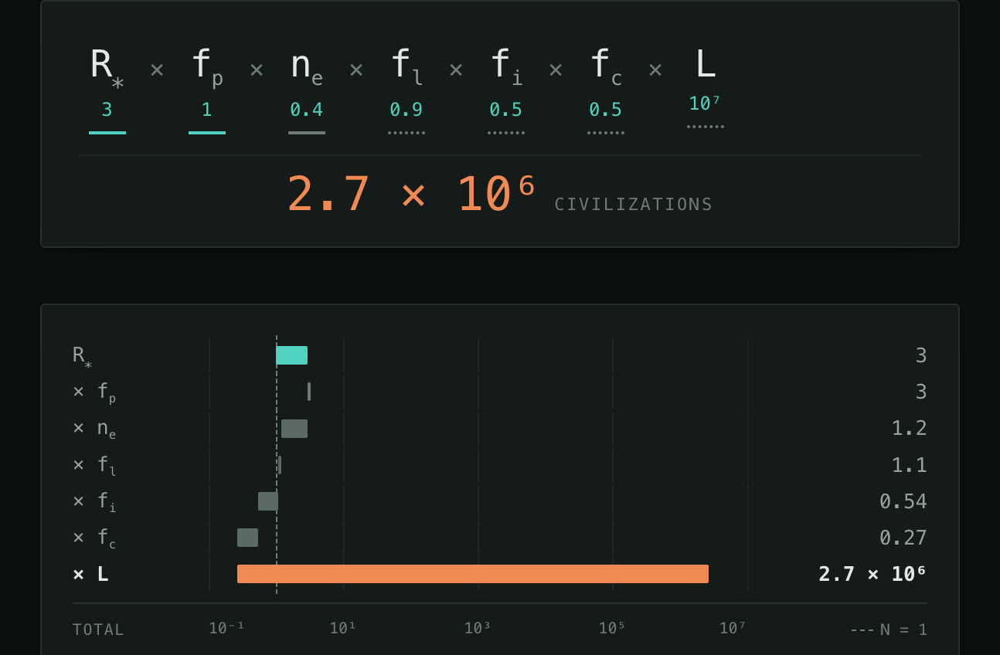

# The Drake Equation

An interactive calculator for the Drake equation, built as a single self-contained HTML file.

**Live: [calmestnewt.github.io/drake-equation](https://calmestnewt.github.io/drake-equation/)**



```
N = R∗ · f_p · n_e · f_l · f_i · f_c · L
```

## Running it

Open `index.html` in a browser. There is no build step, no package manager, and no
server requirement — it also works over `file://`.

To serve it locally:

```sh
python3 -m http.server 8000
# then open http://localhost:8000
```

Since the whole site is one static file, `index.html` can be deployed to GitHub Pages,
Netlify, S3, or any static host by copying it as-is. This repository serves `main` at the
repo root via GitHub Pages, so every push to `main` redeploys the live site.

## What it does

- **Seven log-scaled dials**, one per term. Each also takes direct numeric entry,
  including scientific notation (`1e-5`).
- **Certainty marked in the equation itself.** Each term is underlined by how well it
  is known — solid for measured, solid grey for estimated, dotted for no data — so the
  three-measurements-and-four-guesses shape of the problem is visible in the headline
  figure, not just in the table below it.
- **A cascade chart** plotting the running product on a logarithmic axis. Each row spans
  only the distance its term moves the total, so the length of a bar is the size of that
  assumption's effect: terms above 1 push right, terms below 1 pull back in grey, and a
  term of exactly 1 draws a standstill tick. A dashed rule marks N = 1 — the line between
  someone broadcasting and no one. Below, the "Optimistic" preset in dark theme: six
  terms hold the total near 1, and `L` alone carries it to 2.7 million.

  

- **Consequence readouts**: N, the mean distance to the nearest civilization, and the
  round-trip time for a signal.
- **Four presets** spanning about ten orders of magnitude, each with a short note on
  whose argument it represents.

## Where the numbers come from

Three of the seven terms rest on measurements; the page labels each term accordingly
(`Measured` / `Estimated ±` / `No data`) rather than presenting them as equally solid.

| Term | Default | Basis |
|------|---------|-------|
| R∗   | 3 /yr   | 1.65 ± 0.19 M☉/yr — Licquia & Newman 2015 (ApJ 806:96), converted at a mean stellar mass of ~0.5 M☉ |
| f_p  | 1       | ≳1 bound planet per star — Cassan et al. 2012 (Nature 481:167) |
| n_e  | 0.4     | η⊕ ≈ 0.4 (+0.5 / −0.2), conservative habitable zone — Bryson et al. 2021 (AJ 161:36) |
| f_l, f_i, f_c | 1 | No observational constraint |
| L    | 10⁴ yr  | No observational constraint |

The four unconstrained terms default to 1 so the opening figure reads as a **ceiling** —
the most the data alone permits — rather than an estimate dressed up as one.

Nearest-neighbour distances assume civilizations spread evenly through a galactic disk
of radius 50,000 ly and thickness 1,000 ly.

## Implementation notes

Vanilla JavaScript, no dependencies, no network requests. A few things that are
deliberate rather than accidental:

- **The source is pure ASCII.** Non-ASCII characters are written as HTML entities in the
  markup and `\uXXXX` escapes in the script, so the page survives being served without a
  charset declaration. The document declares `utf-8` as well; the escaping is the belt to
  that pair of braces.
- **Themes are token-only.** The bare `:root` block defines the complete light palette;
  dark is redefined twice — under `prefers-color-scheme` (guarded against an explicit
  light choice) and under `[data-theme="dark"]` — so all three viewer states resolve.
  No color is defined solely inside a media or `[data-theme]` block.
- **Every size below body text sits on one small-type scale** (`--t-nano` through
  `--t-body`), which the handheld breakpoint redefines in a single block rather than
  overriding sizes rule by rule. Nothing drops below 10px there, and the editable fields
  reach 16px — the threshold under which iOS zooms the page in on focus.
- **No `vh` units**, so a mobile URL bar collapsing cannot reflow the layout.
- The sticky equation panel turns itself off below 460px of viewport height, where it
  would cost too much of a short screen.

## License

[MIT](LICENSE) © 2026 CalmestNewt

The cited research (Licquia & Newman 2015, Cassan et al. 2012, Bryson et al. 2021) is
the work of its respective authors and is referenced here, not redistributed.
